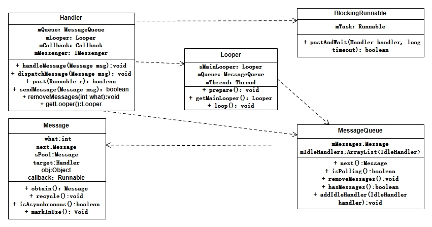
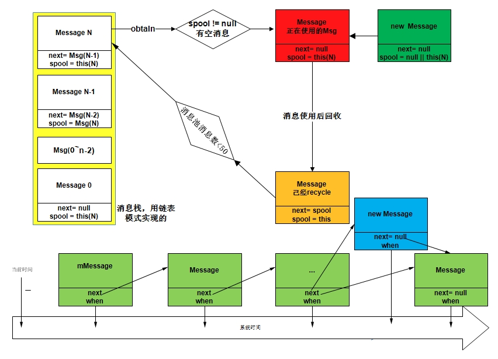

# 系统原理

消息机制分为这么两个阶段
* 1、消息轮询机制
* 2、发送消息

第一阶段，从Looper的prepare开始，会根据当前线程创建一个单例的Looper对象并保存在ThreadLocalMap当中，然后还会为这个Looper创建一个MessageQueue就是一个普通的类并非是一个队列，里面定义消息的关联机制。在MessageQueue构造方法中调用Native方法，初始化了对应的NatvieMessageQueue和Looper，在Nativie的Looper当中注册了epoll机制，通过文件描述符来实现阻塞和唤醒。然后通过Looper.loop函数开启了一个死循环，当Looper对象被回收或者退出的时候才会跳出循环，这个循环是用来分发消息的。首先在循环当中通过MessageQueue的next方法，在MessageQueue的成员变量mMessage的消息开始遍历。这里的Message有一个成员变量next可以指向下一个Message对象，而且mMessage所指向消息链已经是根据消息发生时间由靠近当前时间到未来时间排好序的，这些逻辑在第二阶段发送消息时完成。在next当中链表头部消息没有target也就是handler会先从遍历所有消息并查找是否由同步屏障消息，如果存在就会先执行该消息，这种消息通过特殊接口进行发送。其他情况下会检查链表头部消息时间与当前时间，如果时间已经过去，那么将mMessage指向下一个消息，当前消息返回。在Looper当中调用对应target的handleMessage方法，该方法就是Handler对象提供需要重新的方法，执行完后会调用recycle回收消息，此时消息池小于最大值50则将该消息放到消息池当中，消息池类似压栈和出栈逻辑，在Message的成员变量spool指向的就是消息池的栈顶消息。

第二阶段，从Handler调用sendXXXMessage开始。其中Message有两种方法获取，一种直接通过构造方法创建，一个通过obtain创建，通过obtain创建如果之前已经通过new创建过message那么，此时消息池当中可能有已经回收的消息对象，则直接使用。拿到消息后，紧接着就是参数校验和添加到消息链当中，这里继续会和MessageQueue当中的mMessage的when进行比较，根据消息对应的when将新消息插入到消息链当中，并让前面Message的next指向当前消息，当前消息的next指向下一个消息，如果没有说明这个消息为最后一个，他的next将为null。
  

# 架构设计



<!--  -->

# 相关问题

* 1、消息机制运行在主线程为什么不ANR？

  因为在应用程序创建的时候ActivityThread当中就保存了主线程的Handler，所有的生命周期方法都是通过消息进行唤醒调用的，另外由于节目绘制VSYNC-APP信号会根据屏幕刷新率会在一定周期内通过消息去调用绘制界面的接口，每次16.6毫秒或者8.8毫秒等，因此阻塞时长不会达到ANR的时长。
* 2、消息队列是队列吗？

  消息队列并不是真正队列实现，而是逻辑类似队列，消息都是二合一对象，一个message对象可以表示当前消息，并可以指向下一个消息。
* 3、消息机制怎么进行线程间通信的？
  
  你采用的是主线程的Hander发送的消息，因此不需要关注如何从子线程发送到主线程的，因为Looper一直运行在对应的线程内。

# 详细实现

## Looper启动

```java
=======================  ActivityThread  ==========================
Looper.prepareMainLooper();
Looper.loop();

private static void prepare(boolean quitAllowed) {
    sThreadLocal.set(new Looper(quitAllowed));
}

private Looper(boolean quitAllowed) {
    mQueue = new MessageQueue(quitAllowed);
    mThread = Thread.currentThread();
}

MessageQueue(boolean quitAllowed) {
    mQuitAllowed = quitAllowed;
    mPtr = nativeInit();
}

public static void loop() {
    final Looper me = myLooper();// 获取prepare创建的Looper对象
    // 置为已经循环
    me.mInLoop = true;
    // adb shell 'setprop log.looper.1000.main.slow 1 && stop && start'
    final int thresholdOverride =SystemProperties.getInt("log.looper." + Process.myUid() + "." + Thread.currentThread().getName()
                    + ".slow", 0);
    for (;;) { // 开启循环
        if (!loopOnce(me, ident, thresholdOverride)) {
            return;
        }
    }
}

private static boolean loopOnce(final Looper me, final long ident, final int thresholdOverride) {
    Message msg = me.mQueue.next(); //获取一个消息，如果消息触发时间没到，则进入阻塞状态
    if (msg == null) return false;// 没有消息表示消息队列正在退出。
    try {
        msg.target.dispatchMessage(msg);// 开始一个消息的分发
    } catch (Exception exception) {
    }
    msg.recycleUnchecked();// 分发完成回收消息
    return true;
}

Message next() {
    final long ptr = mPtr;
    if (ptr == 0) return null;// 只有looper对象回收才会退出
    int nextPollTimeoutMillis = 0;// 默认等待时间是0，标识不等待
    for (;;) {// 又开启一个死循环
        nativePollOnce(ptr, nextPollTimeoutMillis);// 将下一个时间传递给native层
        synchronized (this) {
            // Try to retrieve the next message.  Return if found.
            final long now = SystemClock.uptimeMillis();
            Message prevMsg = null;
            Message msg = mMessages;
            if (msg != null && msg.target == null) {
                do {// 查找消息链表当中的屏障消息，先于其前面的同步消息执行，比如绘制VSYNC-APP
                    prevMsg = msg;
                    msg = msg.next;// 找到一个屏障消息或者消息全遍历完才结束循环
                } while (msg != null && !msg.isAsynchronous());
            }
            if (msg != null) {
                if (now < msg.when) {
                    // 如果当前时间不到消息时间则计算需要等待的时间
                    nextPollTimeoutMillis = (int) Math.min(msg.when - now, Integer.MAX_VALUE);
                } else {
                    // 找到了一个消息
                    mBlocked = false;
                    if (prevMsg != null) {// 前一个消息不是空
                        prevMsg.next = msg.next;
                    } else {
                        mMessages = msg.next;
                    }
                    msg.next = null;
                    msg.markInUse();// 标记消息在用
                    return msg;
                }
            } else {// 消息为空说明消息队列当中没有消息因此传递-1
                nextPollTimeoutMillis = -1;
            }
            if (mQuitting) {// 退出 
                dispose();
                return null;
            }
            // 检查是否又idlerHandler
            if (pendingIdleHandlerCount < 0 && (mMessages == null || now < mMessages.when)) {
                pendingIdleHandlerCount = mIdleHandlers.size();
            }
            if (pendingIdleHandlerCount <= 0) {// 没有IlderHandler需要执行
                mBlocked = true;
                continue;
            }
        }
    }
}

public void dispatchMessage(@NonNull Message msg) {
    if (msg.callback != null) {
        handleCallback(msg);
    } else {
        if (mCallback != null) {
            if (mCallback.handleMessage(msg)) {
                return;
            }
        }
        handleMessage(msg);
    }
}
```

## 发送消息

```java
public final boolean sendMessage(@NonNull Message msg) {
    return sendMessageDelayed(msg, 0);
}

public final boolean sendMessageDelayed(@NonNull Message msg, long delayMillis) {
    if (delayMillis < 0) delayMillis = 0;
    return sendMessageAtTime(msg, SystemClock.uptimeMillis() + delayMillis);
}

public boolean sendMessageAtTime(@NonNull Message msg, long uptimeMillis) {
    MessageQueue queue = mQueue;
    if (queue == null) return false;
    return enqueueMessage(queue, msg, uptimeMillis);
}

private boolean enqueueMessage(@NonNull MessageQueue queue, @NonNull Message msg, long uptimeMillis) {
    msg.target = this;
    if (mAsynchronous) { // 没有特殊消息这里都是false
        msg.setAsynchronous(true);
    }
    return queue.enqueueMessage(msg, uptimeMillis);
}

boolean enqueueMessage(Message msg, long when) {
    synchronized (this) {
        msg.markInUse();
        msg.when = when;
        Message p = mMessages;// 第一次是null
        boolean needWake;
        if (p == null || when == 0 || when < p.when) {
            // 只有这个消息，or 马上要响应 or 有多个消息，这个消息早于其他消息
            msg.next = p; // 第一个消息的next指向null
            mMessages = msg;// 并让当前消息记录在这里
            needWake = mBlocked; // mBlocked是next当中标识者是否阻塞的标志。true标识现在处于阻塞状态，因此需要唤醒
        } else {
            // 需要把消息插入到指定位置，如果是阻塞，上个消息没有处理对象，是个屏障消息才唤醒
            needWake = mBlocked && p.target == null && msg.isAsynchronous();
            Message prev;
            for (;;) {
                prev = p;
                p = p.next;
                if (p == null || when < p.when) {// 后面没有消息，或者该消息应该在前（理论上不会）
                    break;
                }
                if (needWake && p.isAsynchronous()) {// 如果后面有屏障消息则不唤醒
                    needWake = false;
                }
            }
            msg.next = p; // invariant: p == prev.next
            prev.next = msg; // 没有消息，直接插到后面
        }
        if (needWake) {// 最终唤醒native
            nativeWake(mPtr);// mptr只在退出的时候是0
        }
    }
    return true;
}

```
## Native实现

```c++

private native static long nativeInit();

static jlong android_os_MessageQueue_nativeInit(JNIEnv* env, jclass clazz) {
    NativeMessageQueue* nativeMessageQueue = new NativeMessageQueue();
    if (!nativeMessageQueue) {
        return 0;
    }
    nativeMessageQueue->incStrong(env);
    return reinterpret_cast<jlong>(nativeMessageQueue);
}

NativeMessageQueue::NativeMessageQueue() : mPollEnv(NULL), mPollObj(NULL), mExceptionObj(NULL) {
    mLooper = Looper::getForThread();
    if (mLooper == NULL) {
        mLooper = new Looper(false);
        Looper::setForThread(mLooper);
    }
}

Looper::Looper(bool allowNonCallbacks)
    : mAllowNonCallbacks(allowNonCallbacks),
      mSendingMessage(false),
      mPolling(false),
      mEpollRebuildRequired(false),
      mNextRequestSeq(WAKE_EVENT_FD_SEQ + 1),
      mResponseIndex(0),
      mNextMessageUptime(LLONG_MAX) {
    mWakeEventFd.reset(eventfd(0, EFD_NONBLOCK | EFD_CLOEXEC));
    LOG_ALWAYS_FATAL_IF(mWakeEventFd.get() < 0, "Could not make wake event fd: %s", strerror(errno));

    AutoMutex _l(mLock);
    rebuildEpollLocked();
}

void Looper::rebuildEpollLocked() {
    // Close old epoll instance if we have one.
    if (mEpollFd >= 0) {
        mEpollFd.reset();
    }

    mEpollFd.reset(epoll_create1(EPOLL_CLOEXEC));
    LOG_ALWAYS_FATAL_IF(mEpollFd < 0, "Could not create epoll instance: %s", strerror(errno));

    epoll_event wakeEvent = createEpollEvent(EPOLLIN, WAKE_EVENT_FD_SEQ);
    int result = epoll_ctl(mEpollFd.get(), EPOLL_CTL_ADD, mWakeEventFd.get(), &wakeEvent);
    LOG_ALWAYS_FATAL_IF(result != 0, "Could not add wake event fd to epoll instance: %s",
                        strerror(errno));

    for (const auto& [seq, request] : mRequests) {
        epoll_event eventItem = createEpollEvent(request.getEpollEvents(), seq);

        int epollResult = epoll_ctl(mEpollFd.get(), EPOLL_CTL_ADD, request.fd, &eventItem);
        if (epollResult < 0) {
            ALOGE("Error adding epoll events for fd %d while rebuilding epoll set: %s",
                  request.fd, strerror(errno));
        }
    }
}

private native void nativePollOnce(long ptr, int timeoutMillis);

static void android_os_MessageQueue_nativePollOnce(JNIEnv* env, jobject obj, jlong ptr, jint timeoutMillis) {
    NativeMessageQueue* nativeMessageQueue = reinterpret_cast<NativeMessageQueue*>(ptr);
    nativeMessageQueue->pollOnce(env, obj, timeoutMillis);
}


void NativeMessageQueue::pollOnce(JNIEnv* env, jobject pollObj, int timeoutMillis) {
    mLooper->pollOnce(timeoutMillis);
}

private native static void nativeWake(long ptr);

static void android_os_MessageQueue_nativeWake(JNIEnv* env, jclass clazz, jlong ptr) {
    NativeMessageQueue* nativeMessageQueue = reinterpret_cast<NativeMessageQueue*>(ptr);
    nativeMessageQueue->wake();
}

void NativeMessageQueue::wake() {
    mLooper->wake();
}

void Looper::wake() {
    uint64_t inc = 1;
    ssize_t nWrite = TEMP_FAILURE_RETRY(write(mWakeEventFd.get(), &inc, sizeof(uint64_t)));
    if (nWrite != sizeof(uint64_t)) {
        if (errno != EAGAIN) {
            LOG_ALWAYS_FATAL("Could not write wake signal to fd %d (returned %zd): %s",
                             mWakeEventFd.get(), nWrite, strerror(errno));
        }
    }
}

private native static boolean nativeIsPolling(long ptr);

static jboolean android_os_MessageQueue_nativeIsPolling(JNIEnv* env, jclass clazz, jlong ptr) {
    NativeMessageQueue* nativeMessageQueue = reinterpret_cast<NativeMessageQueue*>(ptr);
    return nativeMessageQueue->getLooper()->isPolling();
}


```