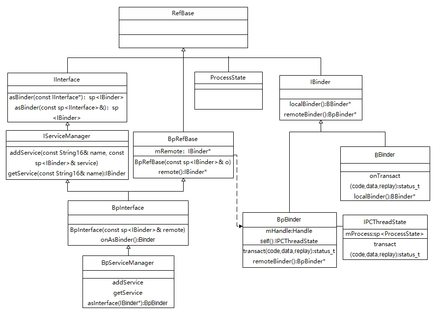
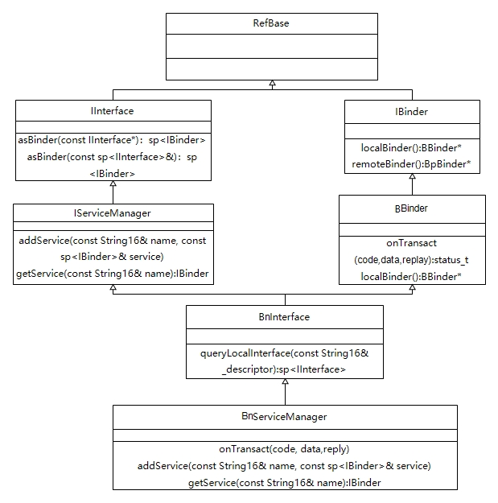

# 系统原理

Binder机制分为四个阶段
* 初始化binder驱动

  在binder.c当中调用宏init_device将函数指针binder_init加入到初始化数组当中，当kernel加载后会遍历调用，因此会执行该函数指针，在该函数当中创建了binder节点，还创建了一些proc，stats，transaction等文件和目录，初始化了一个链表binder_procs用于存放进程，最后注册了MISC设备使得上层的open、mmap、ioctl和驱动的binder_open、binder_mmap、binder_ioctl相映射。
* 启动ServiceManager服务

  ServiceManager进程在init进程启动后init.rc当中调用了servicemanager.rc，从而调用了main函数，在main函数当中做了三件事，第一与驱动的binder建立联系，第二创建一个BnServiceManager对象保存在自身集合中，同时将该对象设置给驱动，第三使用looper开启循环，并且调用talkWithDriver给驱动发送BC_ENTER_LOOPER告诉驱动服务端已经循环等待客户端连接。

  在启动过程中会创建一个ProcessState,该类是一个单例，一个进程只有一个对象，还会创建一个IPCThreadState对象，该对象一个线程一个。在ProcessState的构造方法中会调用open即就是binder_open与驱动测进行连接，在驱动侧为当前进程创建了一个binder_proc的结构体将进程信息保存在其中，然后通过ioctl对应驱动的binder_ioctl将版本、最大线程数写入到驱动中，驱动将其保存到刚刚创建的结构体当中。另外调用mmap即就是binder_mmap通过该函数为当前进程在内核空间分配一块不大于4兆的内存空间，用于交换共享数据，实现一次拷贝。在启动过程当中由于ServiceManager管理这所有服务，比较特殊他在驱动中的标识是0，因此需要调用ioctl发送BECOME_BINDER_MANAGER_CONTEXT的命令，将BnManagerService对象写入驱动，创建一个node节点作为全局的管理。当BnServiceManager进入循环后，需要调用talkWithDriver调用ioc发送BINDER_WRITE_READ命令给驱动，在结构体当中携带了BC_ENTER_LOOPER,在驱动侧会处理该命令，创建一个线程同时将这个线程设置为循环状态，然后回到ServiceManager后继续发送了BC_ENTER_LOOPER此时更改为读数据，由于目前驱动侧没有工作，会调用方法进入阻塞状态，等待事件打断。

* 添加service到ServiceManager
  
  添加一个服务实际上是获取一个BpManagerService对象，然后调用BnManagerService的addService方法将服务在驱动侧的handle保存。每个服务在创建ProcessState时都与驱动进行管理并创建了binder_proc结构体，也同样的映射了内存。

* 获取service从ServiceManager
  
  获取Service就是通过获取一个BpManagerService对象从而通过Binder驱动从BnServiceManager当中查询获得其服务在驱动当中的标识handle，将该handle创建一个对应服务的BpInterface的子类，从而通过这个子类调用对应的BnInterface的子类方法，这之间的调用都是通过handle标识服务，code标识调用方法。从而实现用Bp调用Bn的方法。这之间的数据都是通过内核进行交换。
  
Binder机制通过共享内存的方式实现了跨进程通信，数据在客户端进程和服务端进程只需要拷贝一次，其内存共享数据拷贝都在内核空间实现。首先系统在启动的时候会启动一个ServiceManager进程，让该进程和Binder驱动建立关系，并保存在Binder驱动当中，该进程的标识handle为0，让服务的BnServiceManager进入循环并在驱动测阻塞。Client进程通过调用ServiceManager的接口，获取到BpBinder的实现类，并将Server进程的标识0、数据指针和方法标识code传递给内核驱动，此时就说明需要驱动找到ServiceManager作为Server并调用code标识的方法进行业务处理，驱动收到事务后将客户端传递的数据拷贝到ServiceManager的进程当中，紧接着客户端线程会进入阻塞状态，同时唤醒正在处于阻塞状态的ServiceManager进程线程，此时已经从客户端进程转入到服务端进程当中，被唤醒的ServiceManager进程的BnServiceManager就开始执行对应的方法，最后将执行结果拷贝到Client的内存当中，唤醒正在阻塞的客户端进程并进入阻塞状态。经过一次这样的流程后就完成了【Client进程--Server进程-Client进程】的一次数据交换和业务处理。当然获取其他服务也是通过给ServiceManager进程获取到对应Server的BpBinder实现类，从而从驱动当中找到对应的BnBinder的实现类进行对应的操作。

# 架构设计




# 问题

* 1、被添加的是BpBinder还是BBinder对应的服务子类？
* 2、是否每次都需要Servicemanager进程参与
* 3、handle是怎么分配的?
* 4、是不是每个Bn服务必须有一个线程处于阻塞等待状态？
* 5、ServiceManager进程和AMS等同一个进程是怎么区分的？

# 详细实现

## 初始化驱动
```c
#define device_initcall(fn)		__define_initcall(fn, 6)

device_initcall(binder_init);

static int __init binder_init(void)
{
	// 创建binder节点
	binder_debugfs_dir_entry_root = debugfs_create_dir("binder", NULL);
	if (binder_debugfs_dir_entry_root)
		binder_debugfs_dir_entry_proc = debugfs_create_dir("proc",
						 binder_debugfs_dir_entry_root);//创建一个proc
	}

	if (!IS_ENABLED(CONFIG_ANDROID_BINDERFS) &&
	    strcmp(binder_devices_param, "") != 0) {
		while ((device_name = strsep(&device_tmp, ","))) {
			ret = init_binder_device(device_name);
		}
	}
	return ret;
}

const struct file_operations binder_fops = {
	.unlocked_ioctl = binder_ioctl,
	.compat_ioctl = binder_ioctl,
	.mmap = binder_mmap,
	.open = binder_open,
};

static int __init init_binder_device(const char *name)
{
	int ret;
	struct binder_device *binder_device;

	binder_device = kzalloc(sizeof(*binder_device), GFP_KERNEL);
	binder_device->miscdev.fops = &binder_fops;
	binder_device->miscdev.minor = MISC_DYNAMIC_MINOR;
	binder_device->miscdev.name = name;
	refcount_set(&binder_device->ref, 1);
	binder_device->context.binder_context_mgr_uid = INVALID_UID;
	binder_device->context.name = name;
	mutex_init(&binder_device->context.context_mgr_node_lock);

	ret = misc_register(&binder_device->miscdev);

	hlist_add_head(&binder_device->hlist, &binder_devices);
	return ret;
}

```

## 启动ServiceManager

``` c++
init.rc
start servicemanager
servicemanager.rc
service servicemanager /system/bin/servicemanager

int main(int argc, char** argv) {
    const char* driver = argc == 2 ? argv[1] : "/dev/binder";
    // 创建当前进程对象ProcessState
    sp<ProcessState> ps = ProcessState::initWithDriver(driver);

    // 创建一个BnServiceManager对象并添加到自身当中
    sp<ServiceManager> manager = sp<ServiceManager>::make(std::make_unique<Access>());
    if (!manager->addService("manager", manager, false /*allowIsolated*/, IServiceManager::DUMP_FLAG_PRIORITY_DEFAULT).isOk()) {
        LOG(ERROR) << "Could not self register servicemanager";
    }
    // 创建线程对象IPCThreadState将BnServiceManager对象添加到驱动当中
    IPCThreadState::self()->setTheContextObject(manager);
    ps->becomeContextManager();
    // 创建一个looper对象
    sp<Looper> looper = Looper::prepare(false /*allowNonCallbacks*/);
    // 设置消息回调
    BinderCallback::setupTo(looper);
    ClientCallbackCallback::setupTo(looper, manager);

    //让消息开始循环
    while(true) {
        looper->pollAll(-1);
    }
}

sp<ProcessState> ProcessState::initWithDriver(const char* driver)
{
    return init(driver, true /*requireDefault*/);
}

sp<ProcessState> ProcessState::init(const char *driver, bool requireDefault)
{
    int ret = pthread_atfork(ProcessState::onFork, ProcessState::parentPostFork,
                                 ProcessState::childPostFork);
    gProcess = sp<ProcessState>::make(driver);

    return gProcess;
}

// #define _SC_PAGE_SIZE 0x0028  十进制40
// 1M - 2*40K  
#define BINDER_VM_SIZE ((1 * 1024 * 1024) - sysconf(_SC_PAGE_SIZE) * 2)
#define DEFAULT_MAX_BINDER_THREADS 15

ProcessState::ProcessState(const char* driver) // dev/binder
      : mDriverName(String8(driver)),mDriverFD(-1),mVMStart(MAP_FAILED),mMaxThreads(DEFAULT_MAX_BINDER_THREADS), // 15 
{
    base::Result<int> opened = open_driver(driver);// 建立驱动
        // 内存映射1M- 2*80k
    mVMStart = mmap(nullptr, BINDER_VM_SIZE, PROT_READ, MAP_PRIVATE | MAP_NORESERVE,
                        opened.value(), 0);

}

#define BINDER_WRITE_READ		_IOWR('b', 1, struct binder_write_read)
#define BINDER_SET_MAX_THREADS		_IOW('b', 5, __u32)
#define BINDER_VERSION			_IOWR('b', 9, struct binder_version)
#define BINDER_SET_CONTEXT_MGR		_IOW('b', 7, __s32)

static base::Result<int> open_driver(const char* driver) {
    int fd = open(driver, O_RDWR | O_CLOEXEC);
    status_t result = ioctl(fd, BINDER_VERSION, &vers);
    size_t maxThreads = DEFAULT_MAX_BINDER_THREADS;
    result = ioctl(fd, BINDER_SET_MAX_THREADS, &maxThreads);

}

static int binder_open(struct inode *nodp, struct file *filp)
{
	struct binder_proc *proc;
	struct binder_device *binder_dev;
	struct binderfs_info *info;
	struct dentry *binder_binderfs_dir_entry_proc = NULL;
    // 初始化一个binder_proc
	proc = kzalloc(sizeof(*proc), GFP_KERNEL);
	INIT_LIST_HEAD(&proc->todo);
	proc->pid = current->group_leader->pid;
	INIT_LIST_HEAD(&proc->waiting_threads);
	filp->private_data = proc;

	hlist_add_head(&proc->proc_node, &binder_procs);
}

static long binder_ioctl(struct file *filp, unsigned int cmd, unsigned long arg)
{
	int ret;
	struct binder_proc *proc = filp->private_data;//从文件中获取到open创建的proc
	struct binder_thread *thread;
	unsigned int size = _IOC_SIZE(cmd);//获取到命令
	void __user *ubuf = (void __user *)arg;//参数

	thread = binder_get_thread(proc);// 得到一个线程

	switch (cmd) {
	case BINDER_WRITE_READ:
		ret = binder_ioctl_write_read(filp, cmd, arg, thread);
		break;
	case BINDER_SET_MAX_THREADS: {
		int max_threads; // 将最大线程数保存在binder_proc当中
		if (copy_from_user(&max_threads, ubuf,
				   sizeof(max_threads))) {
		}
		proc->max_threads = max_threads;
		break;
	}
	case BINDER_SET_CONTEXT_MGR:
		ret = binder_ioctl_set_ctx_mgr(filp, NULL);
		break;
	case BINDER_VERSION: { // 保存binder的版本
		struct binder_version __user *ver = ubuf;
		if (put_user(BINDER_CURRENT_PROTOCOL_VERSION,
			     &ver->protocol_version)) {
		}
		break;
	}
}

static struct binder_thread *binder_get_thread(struct binder_proc *proc)
{
	thread = binder_get_thread_ilocked(proc, NULL);
	if (!thread) {
		new_thread = kzalloc(sizeof(*thread), GFP_KERNEL);
		thread = binder_get_thread_ilocked(proc, new_thread);
	}
	return thread;
}

static int binder_mmap(struct file *filp, struct vm_area_struct *vma)
{
	struct binder_proc *proc = filp->private_data;
	if ((vma->vm_end - vma->vm_start) > SZ_4M)
		vma->vm_end = vma->vm_start + SZ_4M;
	vma->vm_ops = &binder_vm_ops;
	vma->vm_private_data = proc;
	ret = binder_alloc_mmap_handler(&proc->alloc, vma);
}

bool ProcessState::becomeContextManager()
{
    if (result != 0) {
        int unused = 0;
        result = ioctl(mDriverFD, BINDER_SET_CONTEXT_MGR, &unused);
    }
    return result == 0;
}

static int binder_ioctl_set_ctx_mgr(struct file *filp, struct flat_binder_object *fbo)
{
	int ret = 0;
	struct binder_proc *proc = filp->private_data;
	struct binder_context *context = proc->context;
	struct binder_node *new_node;
	new_node = binder_new_node(proc, fbo);
	new_node->local_weak_refs++;
	new_node->local_strong_refs++;
	new_node->has_strong_ref = 1;
	new_node->has_weak_ref = 1;
	context->binder_context_mgr_node = new_node;
	binder_put_node(new_node);
	return ret;
}

class BinderCallback : public LooperCallback {
public:
    static sp<BinderCallback> setupTo(const sp<Looper>& looper) {
        sp<BinderCallback> cb = sp<BinderCallback>::make();
        int binder_fd = -1;
        IPCThreadState::self()->setupPolling(&binder_fd);
        int ret = looper->addFd(binder_fd, Looper::POLL_CALLBACK,Looper::EVENT_INPUT,cb,nullptr /*data*/);
        return cb;
    }

    int handleEvent(int /* fd */, int /* events */, void* /* data */) override {
        IPCThreadState::self()->handlePolledCommands();
        return 1;  // Continue receiving callbacks.
    }
};

// LooperCallback for IClientCallback
class ClientCallbackCallback : public LooperCallback {
public:
    static sp<ClientCallbackCallback> setupTo(const sp<Looper>& looper, const sp<ServiceManager>& manager) {
        sp<ClientCallbackCallback> cb = sp<ClientCallbackCallback>::make(manager);
        int addRes = looper->addFd(fdTimer,Looper::POLL_CALLBACK,Looper::EVENT_INPUT,cb,nullptr);
        return cb;
    }

    int handleEvent(int fd, int /*events*/, void* /*data*/) override {
        uint64_t expirations;
        int ret = read(fd, &expirations, sizeof(expirations));
        mManager->handleClientCallbacks();
        return 1;  // Continue receiving callbacks.
    }
private:
    ClientCallbackCallback(const sp<ServiceManager>& manager) : mManager(manager) {}
    sp<ServiceManager> mManager;
};

status_t IPCThreadState::setupPolling(int* fd)
{
    mOut.writeInt32(BC_ENTER_LOOPER);
    flushCommands();
    *fd = mProcess->mDriverFD;
    mProcess->mCurrentThreads++;
    return 0;
}

void IPCThreadState::flushCommands()
{
    talkWithDriver(false);
}

status_t IPCThreadState::talkWithDriver(bool doReceive)
{
    binder_write_read bwr;
    const bool needRead = mIn.dataPosition() >= mIn.dataSize();
    const size_t outAvail = (!doReceive || needRead) ? mOut.dataSize() : 0;

    bwr.write_size = outAvail;
    bwr.write_buffer = (uintptr_t)mOut.data();
    bwr.read_size = 0;
    bwr.read_buffer = 0;

    if ((bwr.write_size == 0) && (bwr.read_size == 0)) return NO_ERROR;

    bwr.write_consumed = 0;
    bwr.read_consumed = 0;
    status_t err;
    do {// 将命令发送给驱动，
        if (ioctl(mProcess->mDriverFD, BINDER_WRITE_READ, &bwr) >= 0)
            err = NO_ERROR;
    } while (err == -EINTR);
}

static long binder_ioctl(struct file *filp, unsigned int cmd, unsigned long arg)
{
	int ret;
	struct binder_proc *proc = filp->private_data;//从文件中获取到open创建的proc
	struct binder_thread *thread;
	unsigned int size = _IOC_SIZE(cmd);//获取到命令
	void __user *ubuf = (void __user *)arg;//参数
	// 进入等待
	ret = wait_event_interruptible(binder_user_error_wait, binder_stop_on_user_error < 2);
	thread = binder_get_thread(proc);// 得到一个线程
	switch (cmd) {
	case BINDER_WRITE_READ:
		ret = binder_ioctl_write_read(filp, cmd, arg, thread);
		if (ret)
			goto err;
		break;
    }
	return ret;
}

static int binder_ioctl_write_read(struct file *filp,unsigned int cmd, unsigned long arg,struct binder_thread *thread)
{
	int ret = 0;
	struct binder_proc *proc = filp->private_data;
	unsigned int size = _IOC_SIZE(cmd);
	void __user *ubuf = (void __user *)arg;
	struct binder_write_read bwr;

	if (size != sizeof(struct binder_write_read)) // 校验
	if (copy_from_user(&bwr, ubuf, sizeof(bwr))) // 拷贝数据

	if (bwr.write_size > 0) { // 写大于0
		ret = binder_thread_write(proc, thread,bwr.write_buffer,bwr.write_size,&bwr.write_consumed);
	}

	if (copy_to_user(ubuf, &bwr, sizeof(bwr)))  // 将数据拷贝给用户空间
	return ret;
}

static int binder_thread_write(struct binder_proc *proc,struct binder_thread *thread,
			binder_uintptr_t binder_buffer, size_t size,binder_size_t *consumed)
{
	uint32_t cmd;
	struct binder_context *context = proc->context;
	void __user *buffer = (void __user *)(uintptr_t)binder_buffer;
	void __user *ptr = buffer + *consumed;
	void __user *end = buffer + size;

	while (ptr < end && thread->return_error.cmd == BR_OK) {
		if (get_user(cmd, (uint32_t __user *)ptr))
		ptr += sizeof(uint32_t);

		switch (cmd) {
		case BC_ENTER_LOOPER:// 设置为循环状态
			thread->looper |= BINDER_LOOPER_STATE_ENTERED;
			break;
		*consumed = ptr - buffer;
        }
	}
	return 0;
}

status_t IPCThreadState::handlePolledCommands()
{
    status_t result;

    do {// 此处读取驱动内容，并处于阻塞状态
        result = getAndExecuteCommand();
    } while (mIn.dataPosition() < mIn.dataSize());

    processPendingDerefs();
    flushCommands();
    return result;
}

status_t IPCThreadState::getAndExecuteCommand()
{
    result = talkWithDriver();
}

status_t IPCThreadState::talkWithDriver(bool doReceive) // 默认是true
{
    binder_write_read bwr;
    const bool needRead = mIn.dataPosition() >= mIn.dataSize();
    const size_t outAvail = (!doReceive || needRead) ? mOut.dataSize() : 0;

    bwr.write_size = outAvail;
    bwr.write_buffer = (uintptr_t)mOut.data();

    if (doReceive && needRead) { // 此时读不为0
        bwr.read_size = mIn.dataCapacity();
        bwr.read_buffer = (uintptr_t)mIn.data();
    }

    bwr.write_consumed = 0;
    bwr.read_consumed = 0;
    status_t err;
    do {
        if (ioctl(mProcess->mDriverFD, BINDER_WRITE_READ, &bwr) >= 0)
    } while (err == -EINTR);
}

static int binder_ioctl_write_read(struct file *filp,unsigned int cmd, unsigned long arg,struct binder_thread *thread)
{
	int ret = 0;
	struct binder_proc *proc = filp->private_data;
	unsigned int size = _IOC_SIZE(cmd);
	void __user *ubuf = (void __user *)arg;
	struct binder_write_read bwr;

	if (size != sizeof(struct binder_write_read)) 
	if (copy_from_user(&bwr, ubuf, sizeof(bwr))) // 拷贝数据

	if (bwr.read_size > 0) {
		ret = binder_thread_read(proc, thread, bwr.read_buffer,
					 bwr.read_size,
					 &bwr.read_consumed,
					 filp->f_flags & O_NONBLOCK);
		if (!binder_worklist_empty_ilocked(&proc->todo))
			binder_wakeup_proc_ilocked(proc);
	}
}

static int binder_thread_read(struct binder_proc *proc,
			      struct binder_thread *thread,
			      binder_uintptr_t binder_buffer, size_t size,
			      binder_size_t *consumed, int non_block)
{
	void __user *buffer = (void __user *)(uintptr_t)binder_buffer;
	void __user *ptr = buffer + *consumed;
	void __user *end = buffer + size;

	int ret = 0;
	int wait_for_proc_work;

	if (*consumed == 0) {
		if (put_user(BR_NOOP, (uint32_t __user *)ptr))
			return -EFAULT;
		ptr += sizeof(uint32_t);
	}

	thread->looper |= BINDER_LOOPER_STATE_WAITING;

	if (non_block) {
		if (!binder_has_work(thread, wait_for_proc_work))
			ret = -EAGAIN;
	} else {
		ret = binder_wait_for_work(thread, wait_for_proc_work);
	}

    thread->looper &= ~BINDER_LOOPER_STATE_WAITING;
}

```

## 获取ServiceManager

根据函数调用可以获取ServiceManager会创建或者得到之前创建的一个含有BpBinder的ServiceManagerShim对象
```c
sp<IServiceManager> gDefaultServiceManager = sp<ServiceManagerShim>::make(BpBinder::PrivateAccessor::create(0))

sp<IServiceManager> defaultServiceManager()
{
    sp<AidlServiceManager> sm = nullptr;
    while (sm == nullptr) {
        sm = interface_cast<AidlServiceManager>(ProcessState::self()->getContextObject(nullptr));
        if (sm == nullptr) {
            ALOGE("Waiting 1s on context object on %s.", ProcessState::self()->getDriverName().c_str());
            sleep(1);
        }
    }
    gDefaultServiceManager = sp<ServiceManagerShim>::make(sm);
    return gDefaultServiceManager;
}

sp<IBinder> ProcessState::getContextObject(const sp<IBinder>& /*caller*/)
{
    sp<IBinder> context = getStrongProxyForHandle(0);
    return context;
}

sp<IBinder> ProcessState::getStrongProxyForHandle(int32_t handle)
{
    sp<IBinder> result;
    AutoMutex _l(mLock);
    if (handle == 0 && the_context_object != nullptr) return the_context_object;
    handle_entry* e = lookupHandleLocked(handle);
    if (e != nullptr) {
        IBinder* b = e->binder;
        if (b == nullptr || !e->refs->attemptIncWeak(this)) {
            sp<BpBinder> b = BpBinder::PrivateAccessor::create(handle);
            e->binder = b.get();
            if (b) e->refs = b->getWeakRefs();
            result = b;
        } else {
            result.force_set(b);
            e->refs->decWeak(this);
        }
    }
    return result;
}

DECLARE_META_INTERFACE(ServiceManager)

#define IMPLEMENT_META_INTERFACE(INTERFACE, NAME)  \
    DO_NOT_DIRECTLY_USE_ME_IMPLEMENT_META_INTERFACE(INTERFACE, NAME)    \

#define DO_NOT_DIRECTLY_USE_ME_IMPLEMENT_META_INTERFACE(INTERFACE, NAME)                       
    DO_NOT_DIRECTLY_USE_ME_IMPLEMENT_META_INTERFACE0(I##INTERFACE, I##INTERFACE, Bp##INTERFACE)

#define DO_NOT_DIRECTLY_USE_ME_IMPLEMENT_META_INTERFACE0(ITYPE, INAME, BPTYPE)                     \
    ::android::sp<ITYPE> ITYPE::asInterface(const ::android::sp<::android::IBinder>& obj) {        \
        ::android::sp<ITYPE> intr;                                                                 \
        if (obj != nullptr) {                                                                      \
            intr = ::android::sp<ITYPE>::cast(obj->queryLocalInterface(ITYPE::descriptor));        \
            if (intr == nullptr) {                                                                 \
                intr = ::android::sp<BPTYPE>::make(obj);                                           \
            }                                                                                      \
        }                                                                                          \
        return intr;                                                                               \
    }  
```

## 添加服务(BpServiceManager::addService)

```c++
class BpServiceManager : public BpInterface<IServiceManager>
{
    virtual status_t addService(const String16& name, const sp<IBinder>& service,bool allowIsolated)
    {
        Parcel data, reply;
        data.writeInterfaceToken(IServiceManager::getInterfaceDescriptor());
        data.writeString16(name);
        data.writeStrongBinder(service);
        data.writeInt32(allowIsolated ? 1 : 0);
        status_t err = remote()->transact(ADD_SERVICE_TRANSACTION, data, &reply);
        return err == NO_ERROR ? reply.readExceptionCode() : err;
    }
}

status_t Parcel::writeStrongBinder(const sp<IBinder>& val)
{
    return flattenBinder(val);
}

status_t Parcel::flattenBinder(const sp<IBinder>& binder) {
    BBinder* local = nullptr;
    if (binder) local = binder->localBinder();

    flat_binder_object obj;

    if (binder != nullptr) {
        if (!local) {
        } else {
            obj.hdr.type = BINDER_TYPE_BINDER;
            obj.binder = reinterpret_cast<uintptr_t>(local->getWeakRefs());
            obj.cookie = reinterpret_cast<uintptr_t>(local);
        }
    }

    status_t status = writeObject(obj, false);
    if (status != OK) return status;

    return finishFlattenBinder(binder);
}

status_t BpBinder::transact(uint32_t code, const Parcel& data, Parcel* reply, uint32_t flags)
{
    status = IPCThreadState::self()->transact(binderHandle(), code, data, reply, flags);
}

status_t IPCThreadState::transact(int32_t handle,uint32_t code, const Parcel& data,Parcel* reply, uint32_t flags)
{
    status_t err;
    err = writeTransactionData(BC_TRANSACTION, flags, handle, code, data, nullptr);
    if (reply) {
        err = waitForResponse(reply);
    } else {
        Parcel fakeReply;
        err = waitForResponse(&fakeReply);
    }
}

status_t IPCThreadState::writeTransactionData(int32_t cmd, uint32_t binderFlags,int32_t handle, uint32_t code, const Parcel& data, status_t* statusBuffer)
{
    binder_transaction_data tr;

    tr.target.ptr = 0; 
    tr.target.handle = handle;// 0
    tr.code = code; // ADD_SERVICE_TRANSACTION
    mOut.writeInt32(cmd);// BC_TRANSACTION
    mOut.write(&tr, sizeof(tr));
    return NO_ERROR;
}

status_t IPCThreadState::waitForResponse(Parcel *reply, status_t *acquireResult)
{
    uint32_t cmd;
    int32_t err;

    while (1) {
        if ((err=talkWithDriver()) < NO_ERROR) break;
        err = mIn.errorCheck();
        if (err < NO_ERROR) break;
        if (mIn.dataAvail() == 0) continue;
        cmd = (uint32_t)mIn.readInt32();
    }
    return err;
}

status_t IPCThreadState::talkWithDriver(bool doReceive) // false
{
    binder_write_read bwr;
    const bool needRead = mIn.dataPosition() >= mIn.dataSize();
    const size_t outAvail = (!doReceive || needRead) ? mOut.dataSize() : 0;

    bwr.write_size = outAvail;
    bwr.write_buffer = (uintptr_t)mOut.data();
    bwr.write_consumed = 0;
    bwr.read_consumed = 0;
    status_t err;
    do {
        if (ioctl(mProcess->mDriverFD, BINDER_WRITE_READ, &bwr) >= 0)
            err = NO_ERROR;
        else
            err = -errno;
    } while (err == -EINTR);
    return err;
}
```