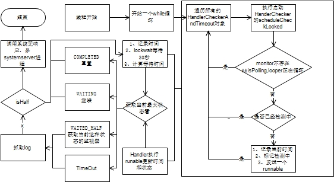

# 流程说明
Watchdog其实就是利用消息机制和锁机制来检测系统中核心线程和服务是否存在长时间阻塞的情况。首先Watchdog在初始化时会创建自己的线程，同时创建主线程、IO线程、显示线程、动画线程、前台线程、surface动画线程并对线程的消息队列进行监控，监控用到了线程对应的Handler和监控对象要实现一个接口。其次在Watchdog启动后在run方法中，会遍历在构造方法当中添加的监控对象，并执行其中的HandlerChecker的scheduleCheckerLocked方法，在方法内会先判断该线程是否存在接口对象和判断当前线程的消息looper是否处于轮询状态，如果是直接进入下一个线程；如果不是要判断上一次是否完成，没完成则继续下一个，完成则记录当前时间，并设置标记正在进行检测，同时给当前的Handler发送一个Runnable对象，在run方法当中与记录的时间进行比较，如果消息不阻塞则获取到当前线程实现的接口对象调用实现的接口，注意此处的接口是在对应线程内，因此不会卡住Watchdog线程。当所有的监控对象被遍历之后，Watchdog线程根据锁机制等待30多秒，然后获取每一个监控对象的执行结果，获取到所有线程中状态更接近超时的状态，如果是完成状态则重置检测标记，如果是不足一半超时时间则继续，如果超过一半超时时间需要记录找到对应状态的线程，并收集一次日志。如果其他情况此时需要重启系统，会获取当前符合条件的监控对象，然后调用AMS的系统无响应接口手机响应的日志，同时根据结果KILL掉SystemServer进程。


# 设计说明
Watchdog利用线程当中的消息机制和锁机制，依赖如图所示：

# 详细实现


## 启动

```java
final Watchdog watchdog = Watchdog.getInstance();
watchdog.start();
```

## 源码说明

Watchdog是一个单例，主要初始化在构造方法当中
* 1、创建一个线程
* 2、在构造方法当中创建了前台线程、IO线程、动画线程、显示线程、UI线程、surface线程六大HandlerChecker
* 3、并创建BinderThreadMonitor对象添加到前台线程的HandlerChecker当中

在start当中
* 1、启动了创建的线程
* 2、在run方法当中创建一个循环,让线程能够一直运行
* 3、


```java

    private static final int COMPLETED = 0;
    private static final int WAITING = 1;
    private static final int WAITED_HALF = 2;
    private static final int OVERDUE = 3;
```

